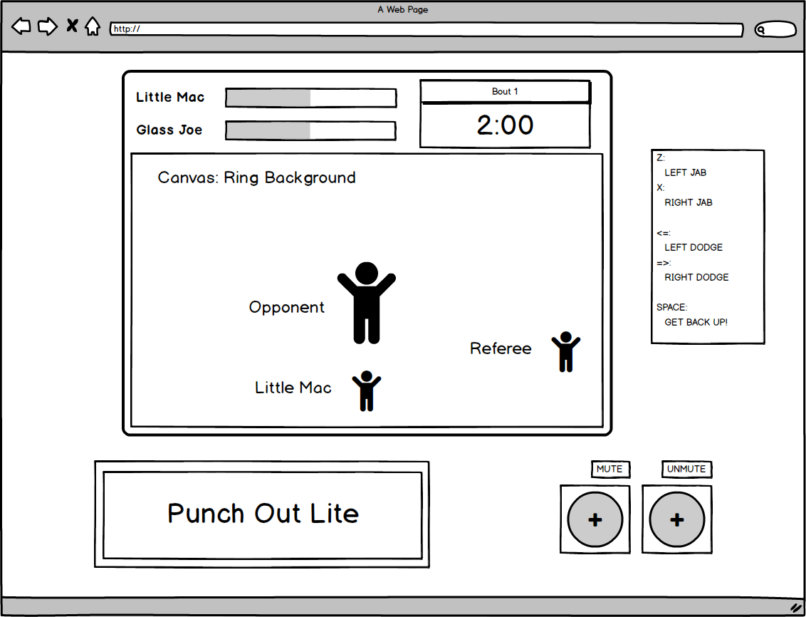

## Punch Out Lite

### Background

Punch Out Lite is a boxing game that is a simplified version of the game Mike Tyson's Punch Out!!! that was originally released on the NES console in 1987. The game features a playable character (Little Mac) who has four basic moves: left jab, right jab, left dodge and right dodge, who must face an opponent who fights back with a set pattern.

The player will face the opponent in a match comprised of three bouts that last for a fixed amount of time. The player wins the entire match by scoring a single knock-out on the the opponent in any of the bouts. The player loses if Little mac is knocked out in two of the three bouts.

The health in this game is represented by a meter that lowers each time either Mac or the opponent is hit. Once this meter is drained, the boxer is knocked down. If the player is knocked down, there is a ten second window where there is a chance for Little Mac to get back up by successively tapping the space key.

### Functionality & MVP  

There are several features that represent the core MVP of the game:

- Little Mac's four moves and animation (Left and right jab, left and right dodge)
- Opponent's moves and animation (Fixed pattern of left and right jabs fired of at set intervals that must be dodged)
- Player and opponent health meters and win/loss after depletion.
- Energy meter that depletes on punch and restores on successful dodge.
- Round start / opponent intro animation.

### Wireframes

This app will consist of a single screen with the game display, a box that displays the keyboard controls for the game, and nav links to my GitHub and LinkedIn. The screen around the game display will be appropriately styled so as to represent the retro feel of the game.

### Architecture and Technologies

This project will completed with minimal library use. Vanilla JavaScript will be used in order to handle the overall structure of the game, DOM manipulation as well as the game logic, while using HTML5 Canvas and sprite sheets in order to render the images and handle the animation of the game.

### Implementation Timeline

**Day 1**: Set up project file structure and JavaScript modules structure. Finish outer display layout and styling (health meters, bout timer, control key, title, mute/unmute buttons, main display container). Set up display background ring sprite and entity sprite positioning (Little Mac, opponent, referee).

**Day 2**: Have background music and mute/unmute functionality working. Get keyboard inputs working to properly animate player punch and dodge animation. Write opponent move pattern and complete opponent punch animation.

**Day 3**: Begin writing out game logic and animation for hits and dodges, health meters, energy meter, and knockdowns.

**Day 4**: Finish writing out previous day's game logic and animation. Write logic for match win/loss. Animate opponent intro.

### Bonus features

Some potential functionality additions found in the original game that could be added:
- Add more detailed win conditions: TKO (3 knock-outs vs 1 for automatic win)/ Decision win (points system), opponent has chance to get up after knockouts.
- Expand player moveset: Left body blow, Right body blow, Duck, Block, Star Punch.
- Add opponents with different / more advanced fighting patterns. (Increasing Difficulty)
- Heart meter system (player stamina)
